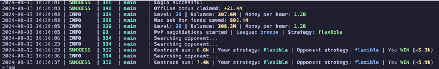

[](https://t.me/hidden_coding)

[](https://t.me/hidden_codding_chat)

[](https://t.me/muskempire_bot/game?startapp=hero6695971335)

# Бот для [Musk Empire](https://t.me/muskempire_bot/game?startapp=hero6695971335)



# Делает все
1. Решает ребусы загадки
2. Смотрит видео на ютубе
3. Прокачивает скилы по профиту те доход в час / на стоимость
4. Прокачивает скилы с тапами все качает до 30 лвла, а восстановление энергии до 50
5. Тапает
6. Можно включить PVP
7. Делает фонды по максимальной ставке для этого сохраняет деньги(на максимальную ставку), что бы сделать ее
8. Сбирает все награды

## Функционал


| Функция                                 | Поддерживается |
|-----------------------------------------|:--------------:|
| Многопоточность                         |       ✅        |
| Привязка прокси к сессии                |       ✅        |
| Задержка перед запуском каждой сессии   |       ✅        |
| Получение ежедневной награды            |       ✅        |
| Получение награды за друзей             |       ✅        |
| Получение награды за выполненные квесты |       ✅        |
| Получение оффлайн бонуса                |       ✅        |
| Автоматические тапы                     |       ✅        |
| PvP переговоры                          |       ✅        |
| Решение ежедневной загадки и ребуса     |       ✅        |
| Инвестирование в фонды (комбо на доход) |       ✅        |
| Авто прокачка                           |       ✅        |
| Docker                                  |       ✅        |

## Настройки

| Опция                   | Описание                                                                                  |
|-------------------------|-------------------------------------------------------------------------------------------|
| **API_ID / API_HASH**   | Данные платформы для запуска сессии Telegram                                              |
| **TAPS_ENABLED**        | Тапы включены дефолт `True` возможно(`False`)                                             |
| **TAPS_PER_SECOND**     | Рандомное число тапов в секунду (дефолт`[20,30]`)                                         |
| **PVP_ENABLED**         | PvP переговоры включены дефолт `True` возможно(`False`)                                   |
| **PVP_LEAGUE**          | Лига в переговорах дефолт`bronze` (`bronze`, `silver`, `gold`, `platina`, `diamond`)      |
| **PVP_STRATEGY**        | Стратегия в переговорах дефолт `random` возоможно(`aggressive`, `flexible`, `protective`) |
| **PVP_COUNT**           | Кол-во переговоров за цикл дефолт `10`                                                    |
| **INVEST_AMOUNT**       | Сумма для инвестирования в фонды дефолт `1400000`                                         |
| **SLEEP_BETWEEN_START** | Задержка перед запуском каждой сессии дефолт `[20, 360]`                                  |
| **ERRORS_BEFORE_STOP**  | Количество неудачных запросов, по достижению которых, бот остановится  дефолт `3`         |
| **USE_PROXY_FROM_FILE** | Использовать-ли прокси из файла `proxies.txt` дефолт `False` Тrue                         |
| **RANDOM_SLEEP_TIME**   | Время сна между событиями  дефолт `5`                                                     |
| **SKILL_WEIGHT**        | Значимость навыка отношение профита к стоимости прокачки(`0.00005`)                       |
| **MONEY_TO_SAVE**       | Минимальное кол-во монет по дефолу `1_000_000`                                            |
| **RANDOM_SLEEP_TIME**   | Время сна после завершения всех действий бота дефолт `[1300, 1700]`                       |

**API_ID** и **API_HASH** вы можете получить после создания приложения
на [my.telegram.org/apps](https://my.telegram.org/apps)

**PvP переговоры** по умолчанию отключены. Включайте на свой страх и риск. Прокачивайте скилы переговоров и этики, чтобы
побеждать при ничьей. Стратегия по умолчанию выбирается рандомно на каждые переговоры. Если хотите, вы можете указать
свою стратегию, она будет использоваться **во всех** переговорах. Названия лиг для параметра **PVP_LEAGUE
**. Названия стратегий для параметра **PVP_STRATEGY
**. Параметр **PVP_COUNT** отвечает за кол-во переговоров, которые бот проведет
за один цикл (бот делает все действия, затем засыпает на случайное время **RANDOM_SLEEP_TIME**, это и есть повторяющийся
цикл).

Ответ на **ежедневную загадку**, а также список фондов с гарантированной прибылью для **инвестирования** загружаются
из [json файла](https://alexell.ru/crypto/musk-empire/data.json) на моем сайте. Я буду стараться заполнять данные
ежедневно, чтобы все ваши запущенные боты могли выполнять эти действия и получать дополнительную прибыль. При
инвестировании, сумма ставки всегда будет максимальная, поскольку профит гарантирован. При недостатке денег на
максимальную ставку, сумма ставки будет понижена.

## Быстрый старт

### Windows

1. Убедитесь, что у вас установлен **Python 3.10** или более новая версия.
2. Используйте `INSTALL.bat` для установки, затем укажите ваши API_ID и API_HASH в .env
3. Используйте `START.bat` для запуска бота (или в консоли: `python main.py`)

### Linux

1. Клонируйте репозиторий: `git clone https://github.com/paveL1boyko/MuskEmpireBot.git && cd MuskEmpireBot`
2. Выполните установку: `chmod +x INSTALL.sh START.sh && ./INSTALL.sh`, затем укажите ваши API_ID и API_HASH в .env
3. Используйте `./START.sh` для запуска бота (или в консоли: `python3 main.py`)

## Запуск в Docker

```
$ git clone https://github.com/paveL1boyko/MuskEmpireBot.git
$ cd MuskEmpireBot
$ cp .env-example .env
$ nano .env # укажите ваши API_ID и API_HASH, остальное можно оставить по умолчанию
```

### Docker Compose (рекомендуется)

```
$ docker-compose run bot -a 1 # первый запуск для авторизации (переопределяем аргументы)
$ docker-compose start # запуск в фоновом режиме (аргументы по умолчанию: -a 2)
```

### Docker

```
$ docker build -t muskempire_bot .
$ docker run --name MuskEmpireBot -v .:/app -it muskempire_bot -a 1 # первый запуск для авторизации
$ docker rm MuskEmpireBot # удаляем контейнер для пересоздания с аргументами по умолчанию
$ docker run -d --restart unless-stopped --name MuskEmpireBot -v .:/app muskempire_bot # запуск в фоновом режиме (аргументы по умолчанию: -a 2)
```

## Ручная установка

Вы можете скачать [**Репозиторий**](https://github.com/paveL1boyko/MuskEmpireBot) клонированием на вашу систему и установкой
необходимых зависимостей:

```
$ git clone https://github.com/paveL1boyko/MuskEmpireBot.git
$ cd MuskEmpireBot

# Linux
$ python3 -m venv venv
$ source venv/bin/activate
$ pip3 install -r requirements.txt
$ cp .env-example .env
$ nano .env # укажите ваши API_ID и API_HASH, остальное можно оставить по умолчанию
$ python3 main.py

# Windows (сначала установите Python 3.10 или более новую версию)
> python -m venv venv
> venv\Scripts\activate
> pip install -r requirements.txt
> copy .env-example .env
> # укажите ваши API_ID и API_HASH, остальное можно оставить по умолчанию
> python main.py
```

Также для быстрого запуска вы можете использовать аргументы:

```
$ python3 main.py --action (1/2)
# или
$ python3 main.py -a (1/2)

# 1 - создать сессию
# 2 - запустить бот
```

## Запуск  бота в фоновом режиме (Linux)

```
$ cd MuskEmpireBot

# с логированием
$ setsid venv/bin/python3 main.py --action 2 >> app.log 2>&1 &

# без логирования
$ setsid venv/bin/python3 main.py --action 2 > /dev/null 2>&1 &

# Теперь вы можете закрыть консоль и бот продолжит свою работу.
```

### Найти процесс бота

```
$ ps aux | grep "python3 main.py" | grep -v grep
```
